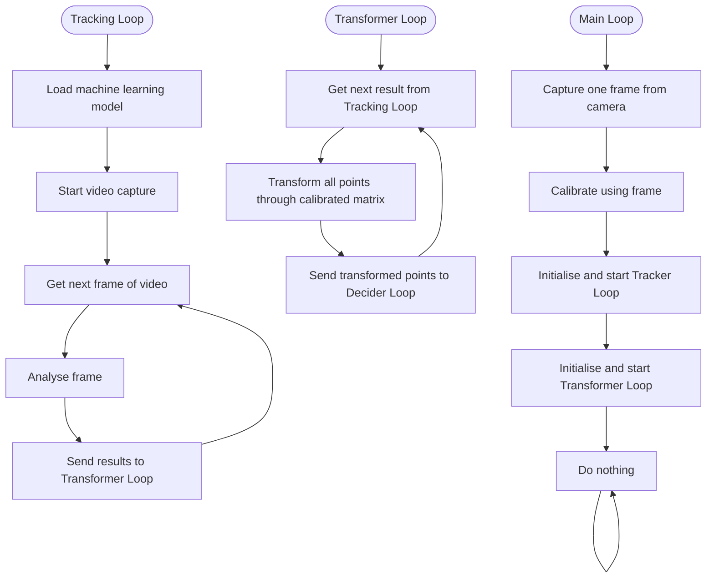

# software that tracks thing on a conveyor belt (s3tcob)

# flow

```mermaid
flowchart TD
TLS([Tracking Loop])
--> LOAD_ML[Load machine learning model]
--> CAP[Start video capture]
--> GET_FRAME[Get next frame of video]
--> AN_FRAME[Analyse frame]
--> SEND_RES[Send results to Transformer Loop]
--> GET_FRAME

TFXL([Transformer Loop])
--> GET_RES[Get next result from Tracking Loop]
--> TFX[Transform all points through calibrated matrix]
--> SEND_TFX[Send transformed points to Decider Loop]
--> GET_RES

MAIN([Main Loop])
--> FRAME_CALIB[Capture one frame from camera]
--> CALIB[Calibrate using frame]
--> INIT_TRACKER[Initialise and start Tracker Loop]
--> INIT_TFX[Initialise and start Transformer Loop]
--> NOOP[Do nothing]
--> NOOP
```
